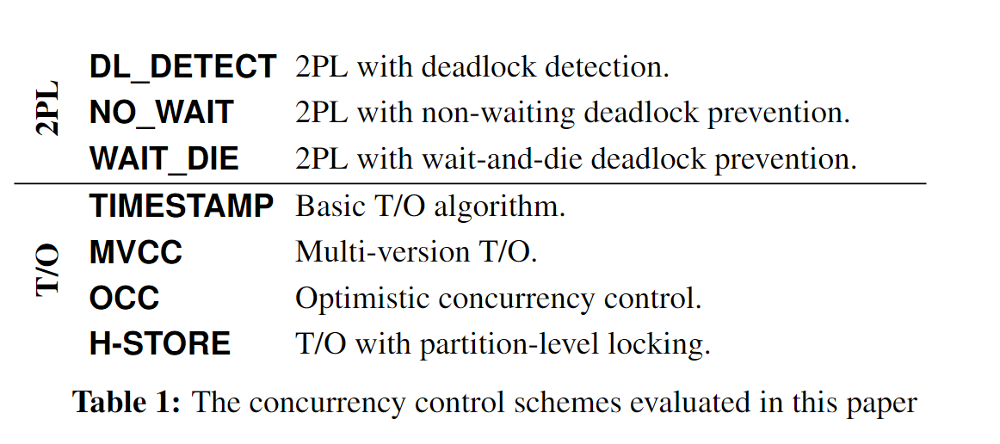

# Staring into the Abyss: An Evaluation of Concurrency Control with One Thousand Cores

## 2. Concurrency control schemes

事务定义：A transaction in the context of one of these systems is the execution of a sequence of one or more operations (e.g., SQL queries) on a shared database to perform some higher-level function.

OLTP 事务的三个特征：

1. they are short-lived
2. they touch a small subset of data using index look-ups (no full table scans or large joins)
3. they are repetitive (i.e., executing the same queries with different inputs)

Concurrency control 涉及了事务 ACID 特性中的原子性和隔离性，Concurrency control 主要有两类方式：

1. Two-Phase Locking (Pessimistic): Assume transactions will conflict so they must acquire locks on database objects before they are allowed to access them.

2. Timestamp Ordering (Optimistic): Assume that conflicts are rare so transactions do not need to first acquire locks on database objects and instead check for conflicts at commit time.

### 2.1 Two-Phase Locking

2PL 的两个阶段：在 growing phase 拿锁，在 shrinking phase 释放锁；但事务提交时或回滚时，会释放掉所有的锁。

2PL  无法避免死锁，因此有不同的 2PL 变种来处理死锁问题

1. 2PL with Deadlock Dection (DL_DETECT)：维护一个 `wait-for graph` ，通过判断是否有环来判断死锁，如果有死锁发生，则随机 abort 掉事务，来打破锁的依赖。
2. 2PL with Non-waiting Deadlock Prevention (NO_WAIT)：一个事务无法获取锁时，直接 abort 掉此次事务。
3. 2PL with Waiting Deadlock Prevention (WAIT_DIE)：如果一个事务比另一持有锁的事务的时间戳小，则允许事务等待另一持有锁的事务，否则，该事务直接 abort 重启。

### 2.2 Timestamp Ordering

1. Basic T/O (TIMESTAMP)：事务开始时获取时间戳，如果事务的时间戳小于元组最后一次写的时间戳，则拒绝读写操作；如果事务的时间戳小于元组的最后一次读时间戳，则拒绝写。读操作会创建元组的拷贝，以确保 repeatable read。
2. Multi-version Concurrency Control (MVCC)：写操作会创建带时间戳的新版本的元组，形成版本链，读操作会在版本链上选择正确的版本；MVCC 的优势是读写操作互不阻塞。
3. Optimisitic Concurrency Control (OCC)：事务在私有空间中进行写操作，事务提交时进行验证阶段查看是否存在冲突。
4. T/O with Partion-level Locking (H-STORE): 将数据库分为互不相交的分区，每个分区对应一个锁，事务开始之前需要拿到其需要的所有分区的锁。