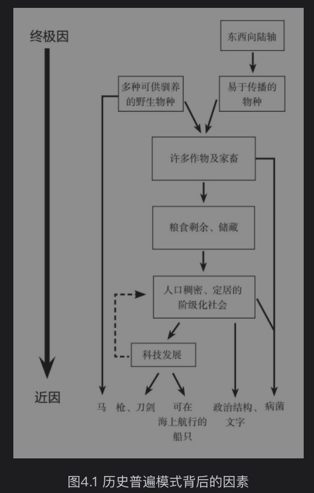

- 农民的力量  
	- 700万年前人猿分家以来，大部分时间里人类都是通过狩猎-采集的方式生存  
	- 1.1万年前才开始有了农牧  
	- 食物生产对枪炮、病菌和钢铁的发展而言，是间接的前提条件  
	- 本章讨论食物生产和种种优势的关联  
		- 第一个关联：越多的卡路里养活越多的人。  
			- 野生动植物里只有一小部分可供人类食用  
			- 
			- 牲畜主要有4种用途：提供肉、奶、肥料，以及犁地。  
				- 犁地使得许多本没有经济价值的土地可转化为农地。  
		- 间接的关联：作物和家畜的生活方式需要人们定居，相比于狩猎-采集社会的人们四处游走，人口密度会提高和生育间隔也会变短。  
			- 比如狩猎-采集社会中的母亲在孩子大到能跟上族人脚步之前，很难再养育一个孩子。  
			- 通过禁欲、杀婴或堕胎等方式控制生育。  
			- 定居生活的另一结果是人们可以存储多余的食物  
				- 从而可以供养不事生产的专家  
				- 发展出复杂的政治单元，如酋邦或者王国  
		- 除此之外，作物还有其他作用，比如提供温暖的衣物等；葫芦在美洲最早被栽培时的作用是容器。  
		- 大型哺乳动物的驯化还未人类提供了主要的陆上运输工具。也是战争的重要工具（马匹）。  
		- 人类社会与家养动物一起演化了更多的病菌。  
			- 当拥有抗体的人和从来未曾感染过这类病菌的人们接触的时候，很可能造成传染病大流行。在欧洲人征服美洲、澳大利亚、南非及太平洋岛屿的时候，扮演了关键角色。  
		- 综上，作物和牲畜带来了更多的食物和人口密度；也因此发展出定居、集群、社会分层、经济复杂、技术创新的社会。作物和牲畜的有无，从根本上解释了为何帝国、文字、钢铁武器最早出现在欧亚大陆。  
	-  