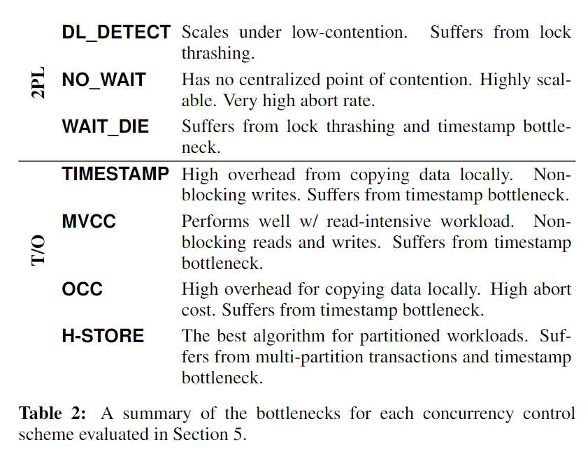

## 6. DISCUSSION

### 6.1 DBMS Bottlenecks

各种策略的瓶颈 :

- lock thrashing
- preemptive abort
- deadlock
- timestamp allocation
- memory-to-memory copy

* 在不同的系统负载上，使用不同的并发控制策略，在竞争少的情况下，可以使用DL_DETECT，而在竞争比较大时可以使用NO_WAIT 或者 T/O方法，例如，MySQL 的只读事务使用 MVCC，其它则使用 2PL。
* 新硬件支持。

