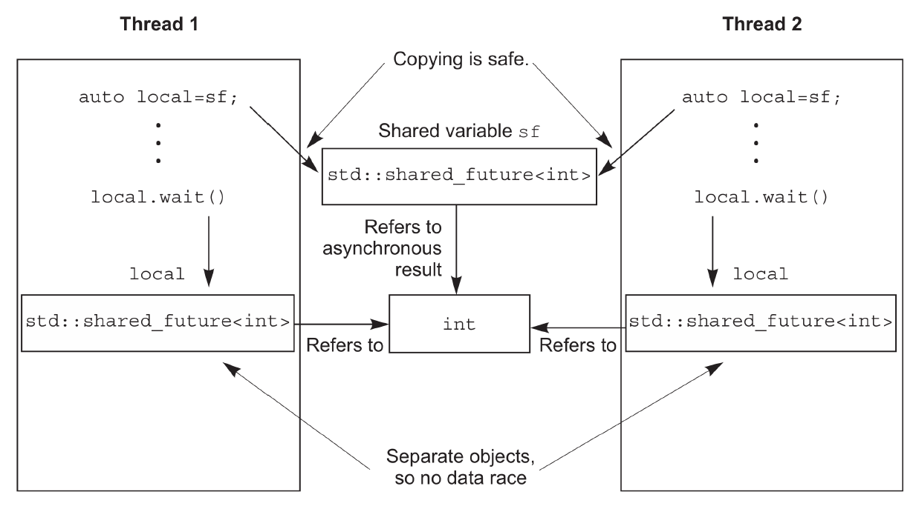

#### 4.2.5 多个线程的等待
多线程在无同步措施的情况下，独立访问 `std::future` 对象对导致数据竞争和未定义行为。

`std::future` 是只移动的，所以其所有权可以在不同的实例中传递，但是只有一个实例可以获得同步结果；而 `std::shared_future` 实例是可拷贝的，所以多个对象可以引用同一关联期望值的结果。

每个线程都拷贝 `std::shared_future` ，多个线程共享结果就是安全的。

  

`std::shared_future` 的构造方式如下：
1. 直接 `std::move` future
2. 从右值构造
3. get_future().share()

```cpp
std::promise<int> p;
std::future<int> f(p.get_future());
assert(f.valid()); // 1 期望值 f 是合法的
std::shared_future<int> sf(std::move(f));
assert(!f.valid()); // 2 期望值 f 现在是不合法的
assert(sf.valid()); // 3 sf 现在是合法的

std::promise<std::string> p;
std::shared_future<std::string> sf(p.get_future()); // 1 隐式转移所有权

std::promise< std::map< SomeIndexType, SomeDataType, SomeComparator,
SomeAllocator>::iterator> p;
auto sf=p.get_future().share();

```