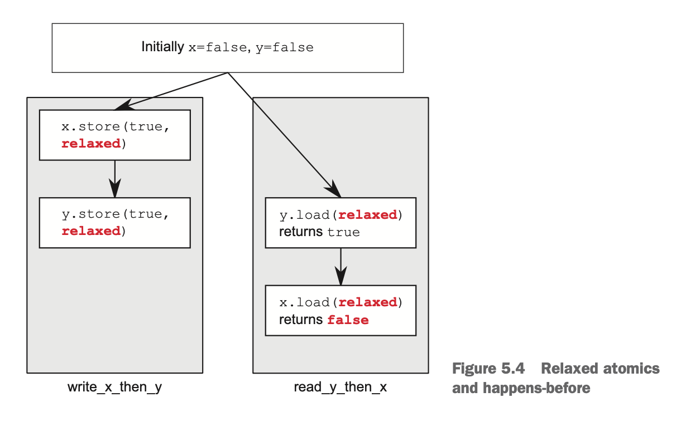

##### RELAXED ORDERING
自由序执行：统一线程对同一个变量的操作遵守 happens before 关系，但不遵从 synchronizes-with。
唯一要求：访问同一线程中的单个原子变量不能重排序；当给定线程看到原子变量的值时，其后该线程的读操作不会读到比该值更早到的值。当使用 memory_order 时，不需要任何额外同步，对每个变量的修改顺序只存在于线程间共享。
Relaxed 操作可以对不同变量进行重排序，只需其符合 happens before 关系即可。
注意：不同的 store / load 操作存在 happens before 关系，但在多对 store/load 操作之间，load 操作可以看到违反顺序的 store 操作。如下图：
  
