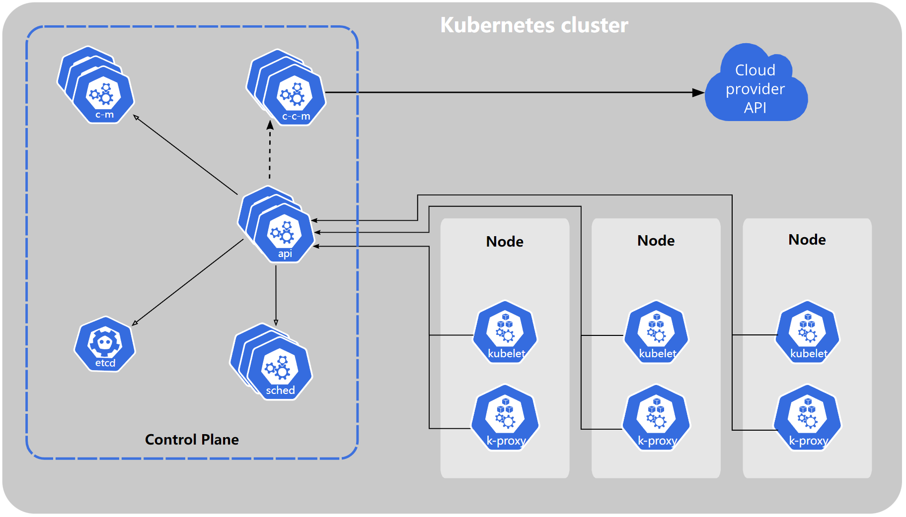

- https://kubernetes.io/zh-cn/docs/concepts/overview/components/#etcd

  ## K8S组件

- 集群 K8s cluster中有一个控制平面（control plane）， 控制平面管理集群中的工作节点（node）和Pod，控制平面跨多台计算机，一个集群通常运行多个节点，工作节点会托管Pod，Pod作为应用负载的组件。

- 

- 控制平面指容器编排层，它暴露API和接口来定义、部署容器和管理容器的生命周期。
- 控制平面组件会为集群做出全局决策，比如资源的调度。
  - kube-apiserver：是控制平面的前端，负责处理接受请求的工作
  - etcd：一致且高度可用的键值存储，用作k8s的所有集群数据的后台数据库
  - kube-scheduler：负责监视新创建的，未指定node的Pods，并选择node来让Pod在上面运行
  - kube-controller-manager：负责运行控制器进程
  - cloud-controller-manager：嵌入了特定于云平台的控制逻辑，允许你将你的集群连接到云提供商的 API 之上， 并将与该云平台交互的组件同与你的集群交互的组件分离开来
- Node组件会在每个node上运行，负责维护pod并提供kubernetes运行环境
  - kubulet接收PodSepcs，确保Podspecs所描述的容器运行状态健康
  - kube-proxy是每个node上所运行的网络代理，维护node上的一些网络规则，以运行集群内部或外部与Pod进行网络通信
  - 容器运行时（container runtime）是负责运行容器的软件，顾名思义就是要掌控容器运行的整个生命周期，Docker 公司与 CoreOS 和 Google 共同创建了 OCI (Open Container Initial)，并提供了两种规范（运行时规范和镜像规范）。目前较为流行的说法是将容器运行时分成了 low-level 和 high-level 两类。low-level: 指的是仅关注运行容器的容器运行时，调用操作系统，使用 namespace 和 cgroup 实现资源隔离和限制。 high-level: 指包含了更多上层功能，例如 grpc调用，镜像存储管理等。K8s支持containerd和CRI-O

- 插件(Addons)使用kubernetes资源实现集群功能
  - DNS：集群DNS是一个DNS服务器，为kubernetes服务提供DNS记录
  - Web界面：Dashboard，用户界面，可以管理集群中运行的应用程序和集群本身
  - 容器资源监控：监控数据浏览界面
  - 集群层面日志：提供集中日志存储服务，同时提供搜索和浏览接口