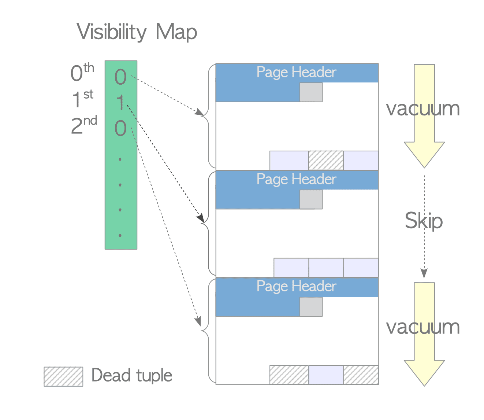
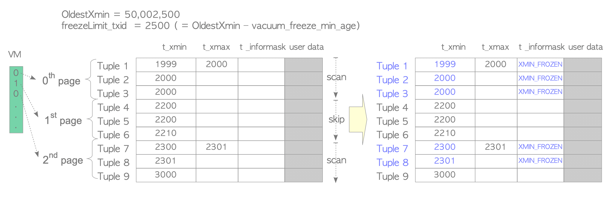
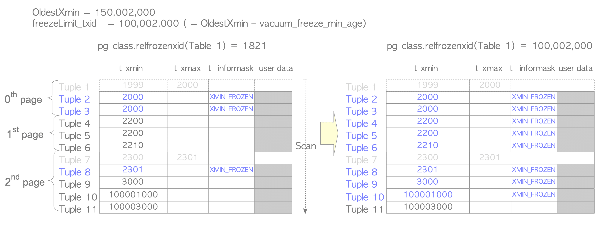
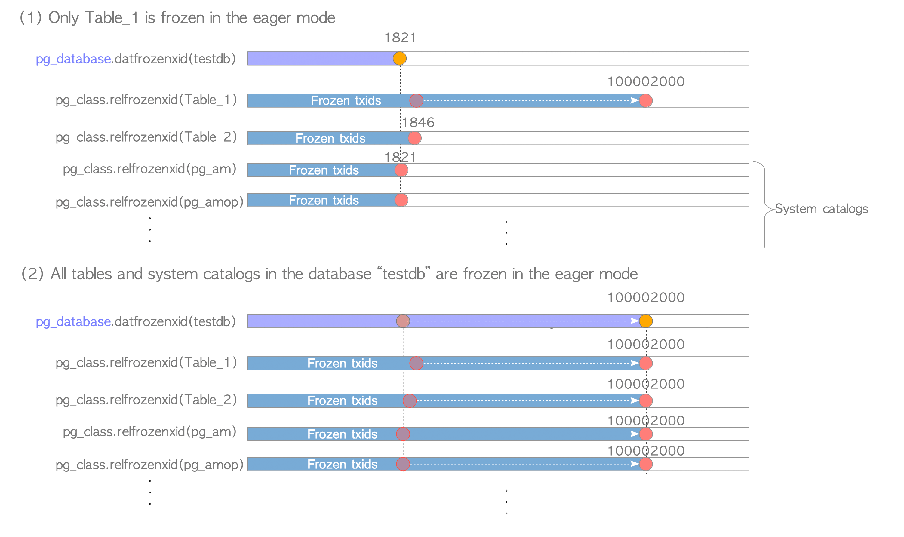
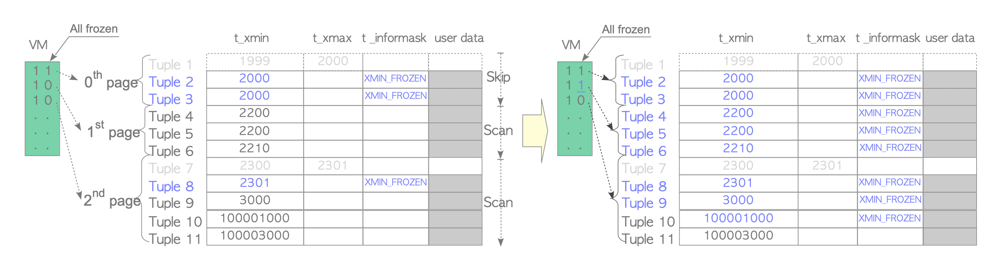

### 6.2 Visibility Map
Each table has an individual visibility map that holds the visibility of each page in the table file. The visibility of pages determines whether each page has dead tuples. Vacuum processing can skip a page that does not have dead tuples.
The VM was enhanced in version 9.6 to improve the efficiency of freeze processing. The new VM shows page visibility and information about whether tuples are frozen or not in each page (Section 6.3.3).

  

### 6.3 Freeze Processing

lazy mode 使用特定表的 VM 文件，并冻结 dead tuples。
earge mode 扫描所有的页，冻结 dead tuples，更新系统表，移出不必要的 clog。
#### 6.3.1. Lazy Mode
When starting freeze processing, PostgreSQL calculates the freezeLimit txid and freezes tuples whose t_xmin is less than the freezeLimit txid.
$$
\begin{align}
	\verb|freezeLimit_txid| = (\verb|OldestXmin| - \verb|vacuum_freeze_min_age|)
\end{align}
$$

  

Before completing the vacuum process, the statistics related to vacuuming are updated, e.g. pg_stat_all_tables' n_live_tup, n_dead_tup, last_vacuum, vacuum_count, etc.

#### 6.3.2. Eager Mode
The eager mode compensates for the defect of the lazy mode. It scans all pages to inspect all tuples in tables, updates relevant system catalogs, and removes unnecessary files and pages of the clog if possible.

  
  

#### 6.3.3. Improving Freeze Processing in Eager Mode
9.5 版本后，如果页面内所有 tuple 都被冻结了，则会在 VM 文件中进行记录，eager mode 下的 freeze 则不会扫描该页面。
  
