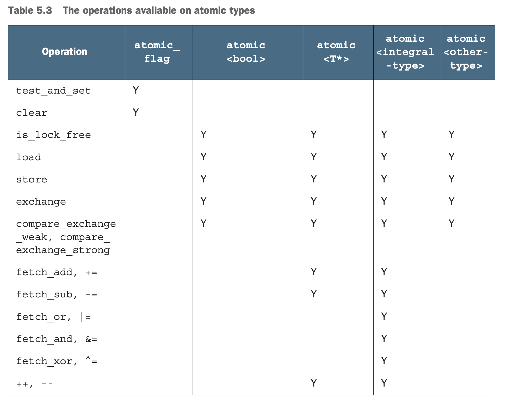

#### 5.2.6 `std::atomic<>` 类模版
UDT 类型使用 `std::atomic<>` 的要求：
* 必须有 trivial copy-assignment operator：
	* 即不能有任何虚函数和虚基类，必须使用 compiler-generated copy-assignment operator。
	* 基类和非静态数据成员必须使用  trivial copy-assignment operator。这意味着编译器可以使用 memcpy() 等操作。
* compare-exchange operations 使用类似于 memcmp 的操作，并非 UDT 重载的 comparison operator。

原子指令
* 如果 UDT 类型小于等于 int 或 void*，则大多数平台会对该  `std::atomic<T>` 使用原子指令。
* 另外，某些平台会对两倍于 int 或 void* 的 UDT 使用 双字节比较和交换指令（DWCAS）。

注意点：
* 虽然 `std::atomic<float>` 或 `std::atomic<double>` 满足使用 memcpy 和 memcmp，但是 compare_exchange_strong 也有可能因为其存储值的不同表达形式而失败。
* `std::atomic<std:: vector<int>>` 具有 non-trivial copy constructor and copy assignment operator，因此不能对该类型特化。
* 对于复杂类型的 UDT，操作越多，具有  trivial copy-assignment operator 的可能性越小；这种情况下使用 `std::mutex` 比原子类型更好。
* `std::atomic<T>` 的可用接口就有: load(), store(), exchange(), compare_exchange_weak(), compare_exchange_strong()和赋值操作，以及向类型T转换的操作。

  
