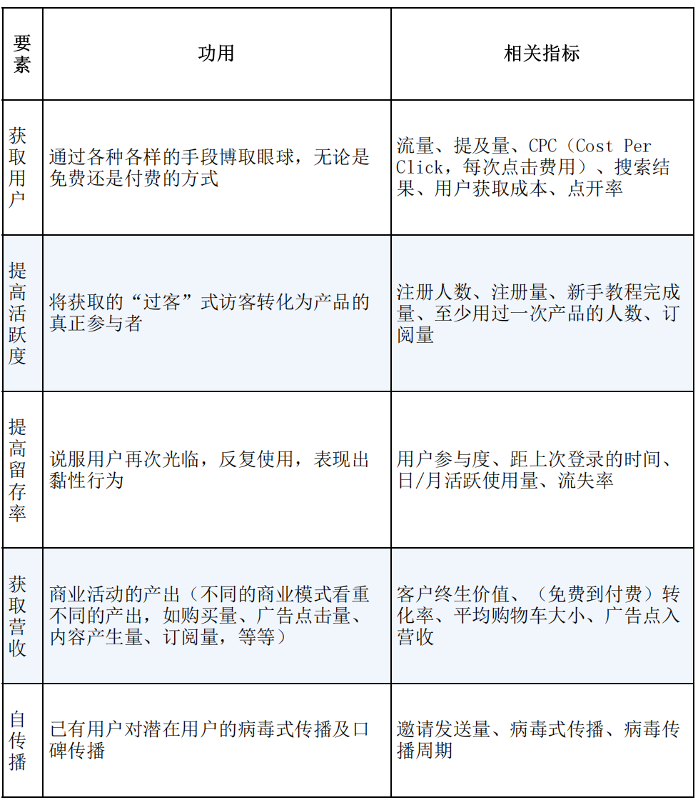

- 创业公司最需要关注的五类指标
  - 获取用户
  - 提高活跃度
  - 提高留存率
  - 获取营收
  - 自传播
- 目前我们公司需要提升的关键部分是活跃度和留存率，特别是留存率

- 

- 可以进一步统计的指标是登录后编辑器内部行为的聚类分析
- 三大增长引擎
  - 黏着式增长引擎
    - 重点是让用户成为持续使用的用户
  - 病毒式增长引擎
    - 病毒式传播系数，即每个新用户所带来的新用户数量
    - 病毒传播周期：用户完成一次邀请所需的时间
  - 付费式增长引擎
    - 两个调节指标：客户终生价值（client lifetime value，CLV），客户获取成本（client access cost，CAC）
    - 一个时间指标：客户盈亏平衡时间（收回获取一位客户的成本所需时间）