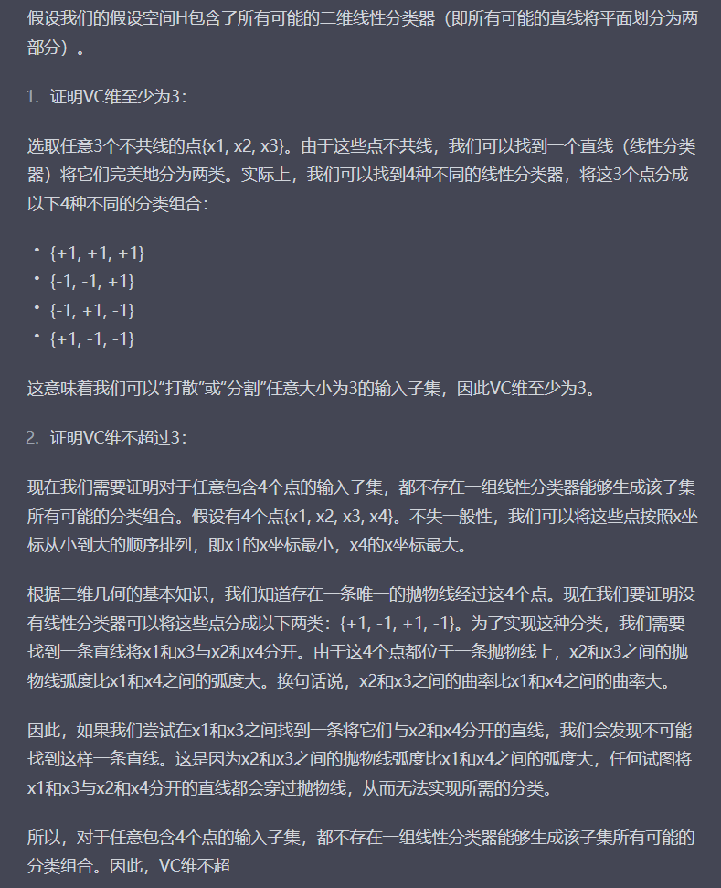

###  第十二章 计算学习理论

##### 12.3.1 可分情形

可分情形意味着目标概念c存在于假设空间中，经推导可以得出所需的样例数目。式12.14可以从另一个角度解读，即的泛化误差随样例数目的增多而收敛到0，收敛速率为O(1/m)  

##### 12.3.2 不可分情形 

略

#### 12.4 VC维

增长函数表示假设空间对示例所能赋予标记的最大可能结果数。比如，对于二分类问题，2示例可能结果有4种，而3示例可能结果则为8种。

这里P275的两个例子都比较好理解，但对于VC维的理解还需要进一步深入。

对了，这里有关于例12.2的证明其实很有意思。

P276 To be continued