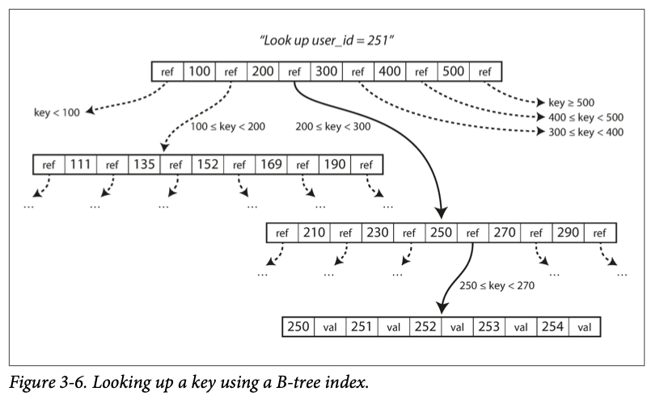
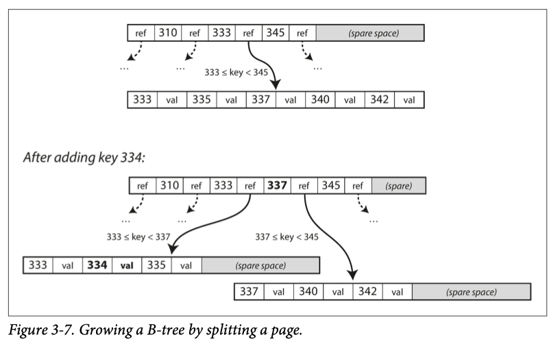

- ### B-Trees  
	- B-Tree 于1970年就被提出，仍是目前在关系型数据库中最为流行的数据索引实现。  
	- 和 LSM-Tree 一样支持高效的点查和范围查询。  
	- 其数据组织形式与LSM-Tree不同：  
		- 以固定大小的页或块来组织数据，每次读取或者写入一个页。  
		- 页可以通过地址标识，彼此之间可以通过类似指针的方式互相引用。  
		- B树的根是其中一个页面，每次查询都会从根页面开始进行。  
	- 
	- 上图是一个具体的查询例子，每次我们读入每一页至内存中后，可以通过二分查找快者找到目标元组可能所在的叶子结点的路径。不断二分，最终我们会达到叶子结点，要么命中，要么说明数据不在B-Tree中。  
	- 
	- 上图则是一个具体的插入例子，首先我们也要先查询到目标Key所在页面，找到的话原地更新即可，否则需要在当前页面插入数据，然后将页面整体写回。  
		- 每一个页面都有一个阈值，如果包含的key超过这个阈值则会将当前页面分裂成两个页面，并在上层页中继插入新的页面的引用；这个过程可能会及联发生。小于某个阈值时也会产生及联合并的操作。  
	- 每层树的分叉数被称为 branching factor；通常在数百个。整体查询时间复杂度和树高度有关，由于B-Tree很好的维护了树的平衡性，对于有n个key的B-Tree来说，查询时间复杂度为O(logn)。  
		-  
		  > A four-level tree of 4 KB pages with a branching factor of 500 can store up to 256 TB.  

	- #### Making B-trees reliable  
		- 由于会原地修改数据，并且可能会由于分裂合并操作调整树的结构，需要引入预写日志，保证数据安全性。  
		- 并发控制也是一个复杂的问题。  
	- #### B-tree optimizations  
		- copy-on-write 替代 WAL。  
		- 非叶子结点可以仅保留路由信息，而不存储数据。  
		- 尽可能使得相邻叶子结点在物理存储上连续。（这是一个很困难的事情）  
		- 叶子节点间增加兄弟节点的指针，遍历查询时效率更高。  
		- fractal trees 借鉴了一些 LSM-tree 的思想。  