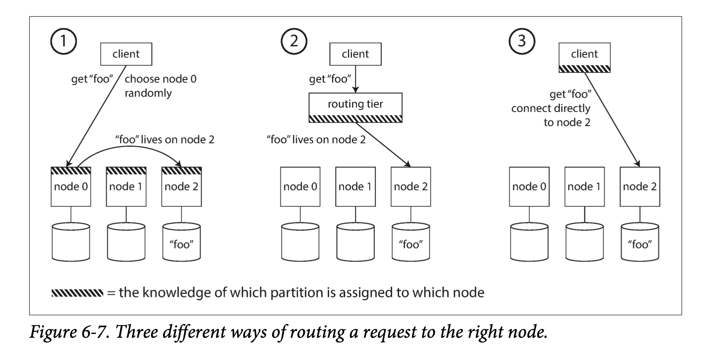

#### 2. Opeartion: Automatic or Manual Rebalancing

自动执行 rebalancing 的缺点：
1. 执行时间难以预测，再平衡操作开销较大，可能会导致网络或节点负载过重，影响其它请求性能。
2. 将自动平衡和自动故障监测结合在一起存在风险：如果某个节点负载过重而响应请求过慢，会被误认为该节点失效，从而导致会将该节点负载迁移到其它节点，这会更加加重系统的整体负载，甚至导致级联失败。

### Request Routing
数据已经分布到多个节点上，当请求查询数据时，如何知道如何将请求发送至哪个节点？

该类问题属于服务发现问题（service discovery），有以下处理策略：
1. 允许客户端连接至任意节点，如果节点没有客户端所请求的分区，则直接转发至下一节点。
2. 将所有客户端的请求都发送至一个路由层， 由一个路由层负责转发至对应节点上。
3. 客户端能感知分区和节点分配关系，客户端可以直连到目标节点。
  

工业界的一些做法：
1. 独立的分布式协调服务，例如 ZooKeeper，每个节点向 ZooKeeper 注册自己，ZooKeeper 维护分区到节点的映射关系。如果发生了映射关系改变，ZooKeeper 会主动通知路由层，使路由信息保持最新。
	例如：HBase, SolrCloud, Kafka 都使用 ZooKeeper。
	  

2. Cassandra 和 Riak 使用 gossip 协议来同步集群状态变化，请求可以发送到任何节点，由该节点负责转发至其它目标节点。增加了数据库节点复杂性，但是避免了对 ZooKeeper 这类外部协调服务的依赖。

#### 1. Parallel Query Execution
MPP 数据库在查询设计上包括多个 Join, Filter, Group, Agg 等操作，MPP 优化器会将复杂的查询分解成多执行阶段和分区，以便其在集群的不同节点上执行。