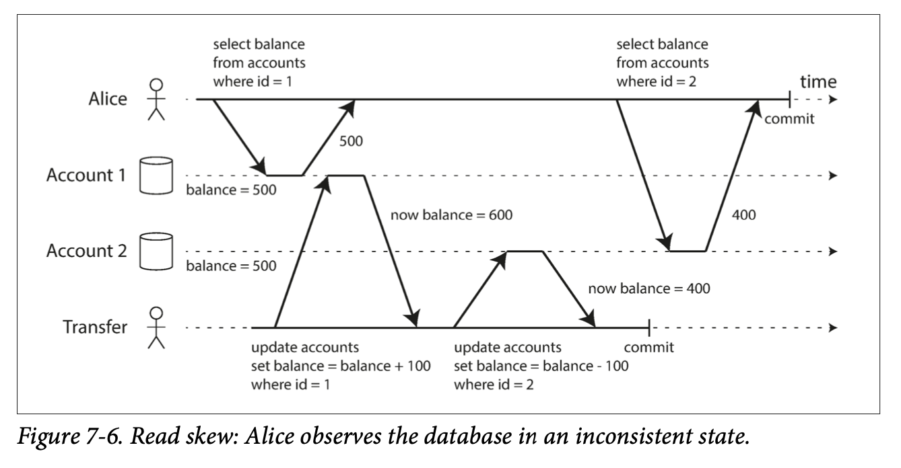

#### 2. Snapshot Isolation and Repeatable Read
不可重复读或读倾斜。

  

在某些场景下，不可重复读是可以暂时容忍的，但是某些场景不能容忍：
* 备份场景：如果在备份过程中持续有数据写入数据库，备份文件中可能包含了旧版本数据和部分新版本数据。如果后续从备份中恢复，会导致永久性的不一致。
* 分析场景或者完整性检查场景：有时候肯能得到无意义的结果。

快照隔离机制：每个事务都从数据的一致性快照中读取，事务开始时只能看到最近提交的数据，随后数据可能被另外一个事务更改，但能保证事务都只看到特定时间点的旧数据。

目前；PostgreSQL，MySQL 的 InnoDB 引擎，Oracle，SQL Server 等数据库均支持快照隔离级别。