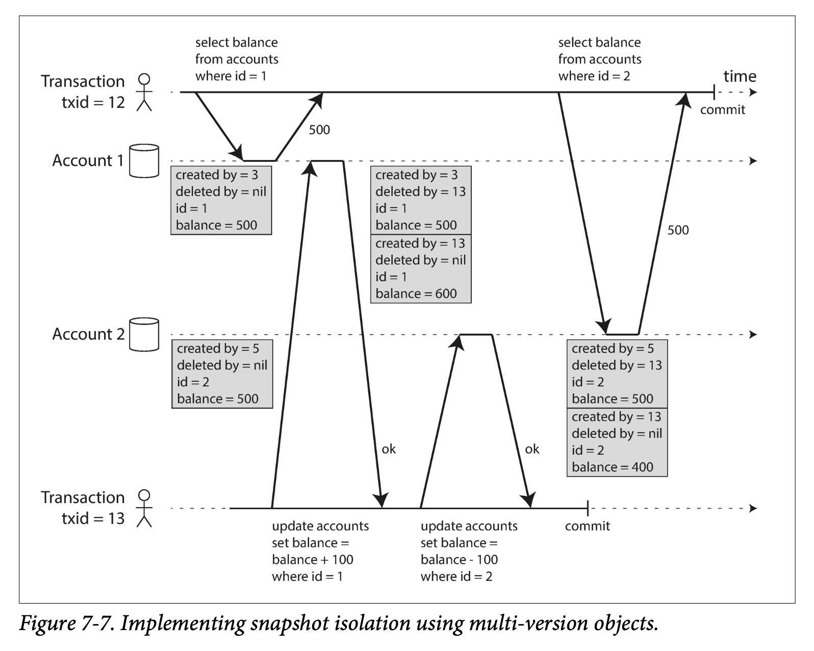

##### Implementing Snapshot isolation
与读已提交隔离类似，快照隔离级别通常采用写锁来防止脏写，正在进行的写操作会阻止同一对象上的其它事务，但读操作则不需要加锁。

为了实现快照隔离级别，数据库采用防止脏读且更为通用的机制 MVCC：由于数据库中多个进行的事务可能会在不同的时间点查看数据库状态，因此数据库保留了多个不同的提交版本。

特别的，如果为了实现读已提交隔离级别，保留同一对象的两个版本就足够了，分别为一个已提交的旧版本和尚未提交的新版本。因此，大部分支持快照隔离级别的存储引擎往往直接采用 MVCC 来实现读已提交。

具体做法：读已提交情况下，对每一个不同的查询单独创建一个快照，而快照隔离级别则使用一个快照来运行整个事务。

上述例子的 pg 实现方式：

  
