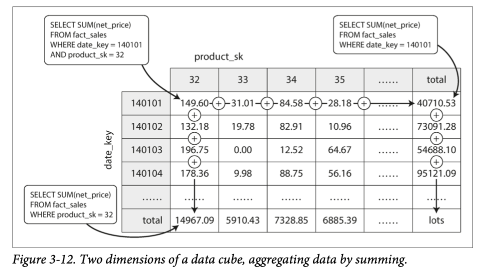

- ## Aggregation: Data Cubes and Materialized Views  
	- 数据仓库常常用于计算复杂的聚合运算；如果我们会反复查询同样的聚合运算，那么一个很自然的想法就是我们可以建立一个缓存  
	- 一种方式就是建立物化视图；表现形式和表没有什么区别，但是底层实际上是对某些查询语句结果的持久化存储；当从物化视图首次读数据的时候，底层的查询会执行，并将查询结果存储下来，同时返回；当底层数据改变的时候，物化视图应该自动修正数据  
		- 在OLTP场景中不常见的一个原因就是，这样的自动修正会带来额外的成本；但是对于OLAP场景来说，写操作是罕见的  
	- 存在一种特殊的物化视图，我们称为 cube；他是从不同维度聚合的网格  
		-   
		- 这样的存储方式可以更高效的存储多维度聚合结果的物化视图；提高查询效率；但是并不是非常灵活的方式，比如，无法支持聚合的时候按照某些其他维度做过滤。  