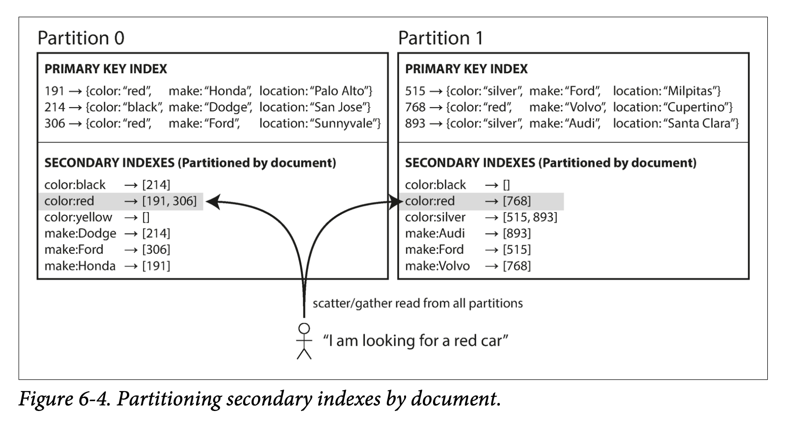
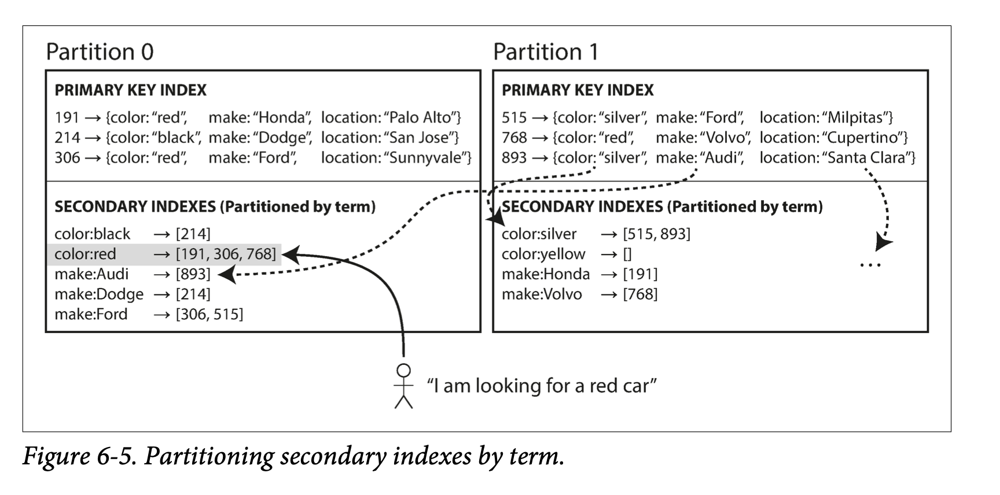

### Partitioning and Secondary Indexes
二级索引是关系性数据库的必备特性。许多 key-value 存储（例如 HBase 和 Voldemort）不支持二级索引，但二级索引是 Solr 和 Elasticsearch 等全文索引的必备项。

二级索引的挑战：不能规则的映射到分区中。

#### 1. Partitioning Secondary Indexes by Document

Document-Partitioned indexes (local indexes)：二级索引同主键key-value 存储在同一分区中，写操作仅需更新一个分区，而读二级索引的操作需要 scatter/gather 所有分区。

  

采用该方式的数据库：MongoDB, Riak, Cassandra, Elasticsearch, SolrCloud, VoltDB 都支持基于文档分区二级索引。

#### 2. Partitioning Secondary Indexes by Term

Term-Partitioned indexes(global indexes): 

  

优点：读取高效，但写入速度慢，写入时可能涉及多个二级索引，而二级索引可能在不同 node 上，从而映入写放大。

局限：对于 Term-Partitioned indexes 来说，难以做到同步更新二级索引，因为可能需要跨多个分区的分布式事务，写入速度会收到较大的影响。（大部分数据库不支持同步更新二级索引）

实践：对二级索引的更新都是异步的。Amazon DynamoDB 二级索引通常可以在 1s 之内完成，但发生故障时，可能需要更久。 Riak 的搜索功能和 Oracle 数据仓库，允许用户选择全局索引还是本地索引。