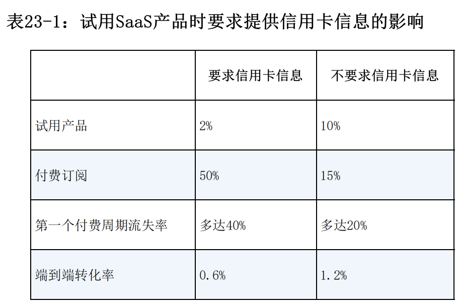

- 网站速度是可以控制的因素，而且改善他会带来实际的好处，要把访客首次访问的时间控制在5s以内
- 软件网站的垂直领域转化率为3.2%，对比之下我们的深度用户比率是2.07%，目前来看转化率偏低
- 

- Saas 产品的底线是 10%的付费订阅功能试用率，25%的购买率
- 免费增值产品在这样的产品上行得通
  - 向新增用户提供服务的成本很低
  - 让人们使用产品的营销成本很低
  - 不需要长期评估和培训
  - 随着时间延长，产品对用户的价值逐渐升高
  - 具有优秀的病毒式传播系数