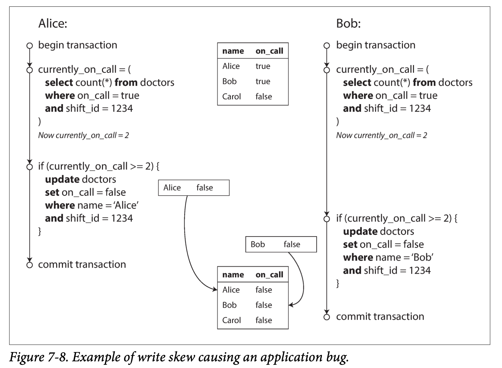

#### 4. Write Skew and Phantoms
当多个事务同时写入同一对象时，会造成上述所讨论的脏写和更新丢失。为了避免该行为，需要借助数据库内部机制，或者采取手动加锁或者执行原子操作。

##### Charactering write skew
写更新定义：两个事物同时读取相同的一组对象，然后更新其中一部分：不同的事务可能更新不同的对象，则可能发生写倾斜；而不同的事物更新的是同一个对象，则可能发生脏写或者更新丢失（具体取决于时间窗口）

  

写倾斜，可选的方案则有很多限制：
* 由于涉及多个对象，单对象的原子操作不起作用
* 基于快照级别隔离级别来实现更新丢失自动检测也有问题，目前所有的数据库实现，包括 PostgreSQL 可重复读，MySQL/InnoDB 可重复读，Oracle 可串行化以及 SQL Server 的快照隔离级别都不支持检测写倾斜问题。自动防止写倾斜**要求真正的可串行化隔离**。
* 数据库支持自定义约束条件，但是某些具体的设计多个对象的约束，大多数数据库不支持，开发者可以实现触发器或者物化试图来自己实现类似约束。
* 如果不能使用可串行化隔离级别，一次次优的选择是对事务依赖的行显示的加锁，例如，SELECT ... FOR UPDATE。

##### More examples of write skew
* 会议室预定。同一时间同一会议室不能被预定两次。
* 多人游戏。
* 网站注册用户名。该例子可以使用唯一性约束来保障。
* 多次交易，两个交易不会超额，但加在一起会超额。

##### Phantoms causing weite skew
上述的写倾斜例子都遵循以下模式：
1. SELECT 查询满足条件的行。
2. 应用层来决定后续操作结果。
3. 应用程序决定后续操作，INSERT / DELETE / UPDATE。如果该操作会改变步骤 2 做出决定的前提条件，则会导致写倾斜。

使用 SELECT ... FOR UPDATE 并没返回任何行，则也无法加锁，因此该方法存在局限性。

幻读：一个事物的写入改变了另一个事物查询结果。快照隔离级别可以避免只读查询的幻读，但无法解决些倾斜问题。

##### Materializing conflicts
如果查询结果中没有对象可以加锁，可以人为引入一些可加速对象。

例如，把会议室预定问题中特定时间特定房间的不同组合列出来，使用 SELECT ... FOR UPDATE 加锁避免幻读问题。

实体化冲突，将幻读问题转换为数据库中特定行的锁冲突问题。但是，具有挑战性，不优雅。
