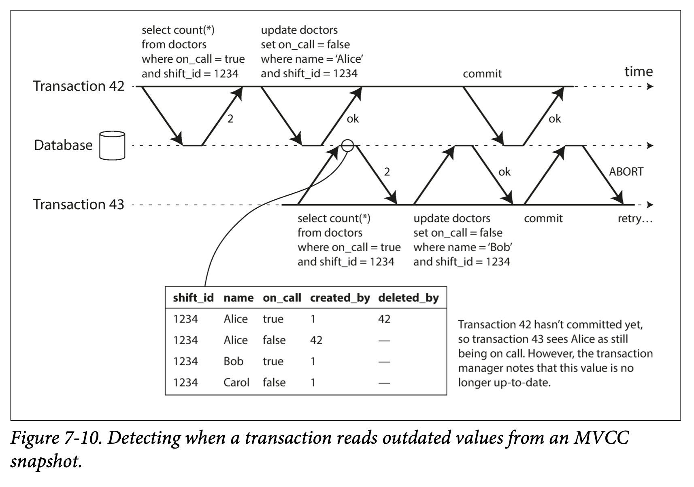
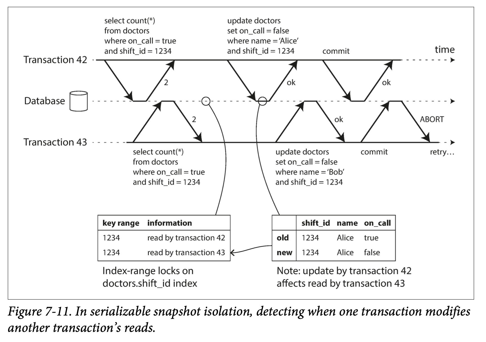

##### Decisions based on outdated premise
在执行时，数据库假定对查询结果（决策的前提条件）的任何变化都应使写事务失效。查询与写事务之间可能存在因果依赖关系。为了提供可串行化的隔离， 数据库必须检测事务是否会修改其他事务的查询结果， 并在此情况下中止写事务。

数据库如何知道查询结果是否发生了变化，有两种方式：
* 检测读取是否作用于一个（即将）过期的 MVCC 对象（读取之前已经有未提交的写入）。
* 检查写入是否影响即将完成的读取。（即读取以后，又有新的写入）。

##### Detecing stale MVCC reads
MVCC 处理写倾斜问题时有如下问题：
  

为了防止这种异常，数据库需要跟踪由于 MVCC 可见性规则而被忽略的写操作。当事务提交时，数据库会检查是否存在**一些当初被忽略的写操作现在已经完成了提交**，如果是则必须中止当前事务。

为什么需要等到提交？监测到读到旧值，为何不中止事务呢？考虑如下：
* 如果图中的事务 43 是个只读事务，没有任何写倾斜风险，不需要中止。
* 事务 43 提交时，事务 42 可能中止或者还处于未提交状态，此时读取的不是旧值，所以也不需要中止。
通过减少不必要的中止，可以支持在长的只读事务。

##### Detecting writes that affect prior reads
  

SSI 同样可以使用索引区间锁，但不会阻塞其它事务。其在索引级别或者表级别上跟踪此信息（哪些食物查询了相同的结果），该额外记录仅需保持很小一段时间，当并发的所有事物都完成（提交或者中止）后，就可以丢弃。

当另一个事务尝试修改时， 它首先检查索引， 从而确定是否最近存在一些读目标数据的其他事务。 这个过程类似于在受影响的字段范围上获取写锁， 但它并不会阻塞读取， 而是直到读事务提交时才进一步通知他们：所读到的数据现在已经发生了变化。

##### Performance of serializable snapshot isolation
性能的考虑，涉及到了具体实践的问题。例如，需要权衡考虑关于跟踪事务读写的粒度：如果需要非常详细的跟踪每个事务的操作，确实可以准确的推测有哪些事务收到影响，但是记录元数据的开销会非常大；而粗粒度的记录则速度占优，但可能会扩大受影响的事务范围。

最大优点：串行化切不需要等锁。

与串行执行相比，可串行化快照隔离可以突破单个CPU核的限制。 FoundationDB将冲突检测分布在多台机器上， 从而提高总体吞吐量。 即使数据可能跨多台机器进行分区， 事务也可以在多个分区上读、 写数据并保证可串行化隔离。

事务中止的比例会显著影响 SSI 的性能表现。例如，长事务（包含读写）产生冲突并中止的概率会增大。因此， SSI 要求读写型事务要简短。
