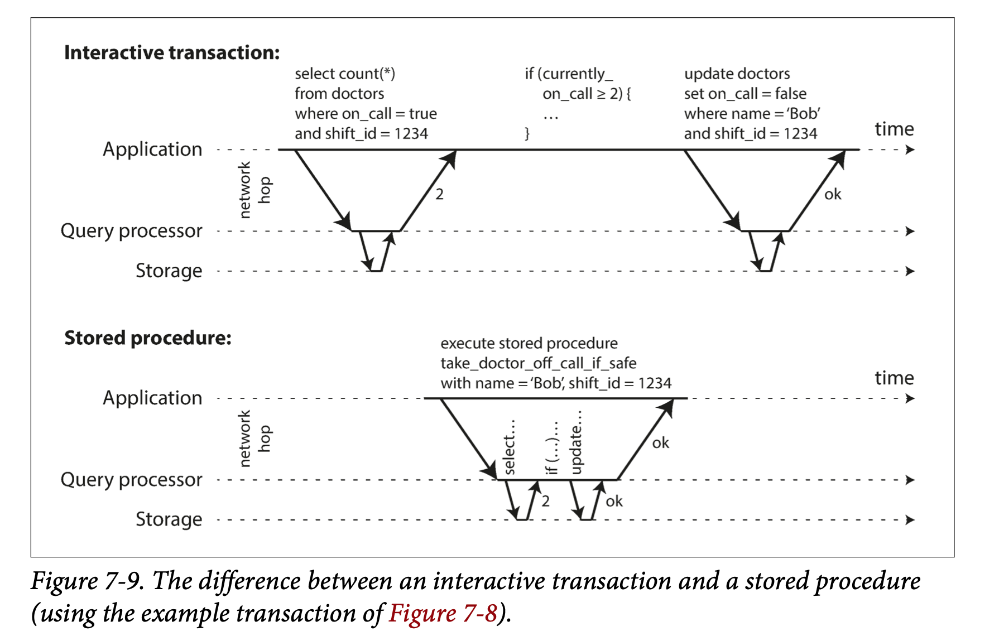

#### 1. Actual Serial Execution
单线程循环执行事务能避免并发。
* 内存价格便宜，许多应用可以将整个活动数据集全部加载到内存中，当事务所需要的所有数据都在内存中时，事务所需要的执行速度会快很多。
* OLTP 应用只产生少量读写操作。

VoltDB / H-Stroe，Redis 和 Datomic 等采用串行方式执行食物。单线程执行有可能会比并发的系统效率更高，可以避免锁开销。其吞吐量上线是单个 CPU 核的吞吐量。为了充分利用单线程，事务也需要作出相应的调整。

##### Encapsulating transcations in stored procedures
交互式事务相关的应用，需要和人类交互，等待来自人类的输入，系统大部分时间处于空闲状态。这样数据库无法高效运行。

对于交互式的事务处理，如果在单线程中处理，那么吞吐量会非常低，数据库总是在等待下一个请求。为了获得足够的吞吐性能，需要能同时处理多个事务。

因此，采取单线程执行的系统往往不支持交互式的多语句事务，应用程序必须把整个事务代码作为存储过程打包发送到数据库。差异如下：

  

##### Pros and cons of stored procedures
缺点：
* 每家数据库厂商都有自己的存储过程语言，设计丑陋，缺乏现代编程语言所常用的函数库。
* 存储过程在数据库中难以管理。调试困难，版本控制与部署复杂，测试不便，并且不容易和指标监控系统集成。
* 数据库实例被多个应用服务器共享，数据库服务器的性能要求更高。设计一个高效的存储过程要求更高。

现代存储过程：VoltDB 使用 Java/Groovy，Datomic 使用 Java/Clojure，Redis 使用 Lua。

优点：存储过程和内存式数据库使得单线程上执行所有事务变得可行，不需要等待 I/O，避免了加锁开销等复杂的并发控制机制，吞吐量高。

VlotDB 存储过程来执行复制。其在每个副本上执行相同的存储过程来实现复制。VoltDB 要求存储过程必须是确定性的（不同节点上运行，结果必须完全相同），如果需要获取当前日期和时间，需要通过专门 API 来实现。

##### Partitioning
对高写入需求的应用来说，单线程处理事务易成为严重的瓶颈。

为了扩展到多个 CPU core 和多节点，可以对数据进行分区。VoltDB 支持该配置模式，选择一个合适的方法来对数据进行分区，使得每个事务只在单个分区内读写数据，使得每个分区都可以有自己的事务处理线程且独立运行。此时为每个 CPU core 分配一个分区，可以使数据库的总体事务吞吐量可以达到与 CPU core 核的数量成线性比例关系。

但是对于需要跨分区执行的事务，需要在多个分区之间协调事务，存储过程需要跨越所有的分区才能执行，以确保整个系统的可串行化。跨分区协调的额外开销造成的性能比单分区要慢得多。

事务能否跨分区执行，取决于应用层的数据结构，例如，简单的 KV 数据易于切分，但带有二级索引的数据则需要大量的跨区协调。

##### Summary of serial execution
串行执行事务可以实现可串行化隔离：
* 事务必须简单高效，慢事务会影响其它事务的执行性能。
* 涉及到磁盘 IO 后，会拖累性能。
* 写入吞吐量必须足够低，才能在单个 CPU 上执行；否则就需要采用分区，最好没有跨分区事务。
* 跨分区事务可以支持，但是必须占比小。