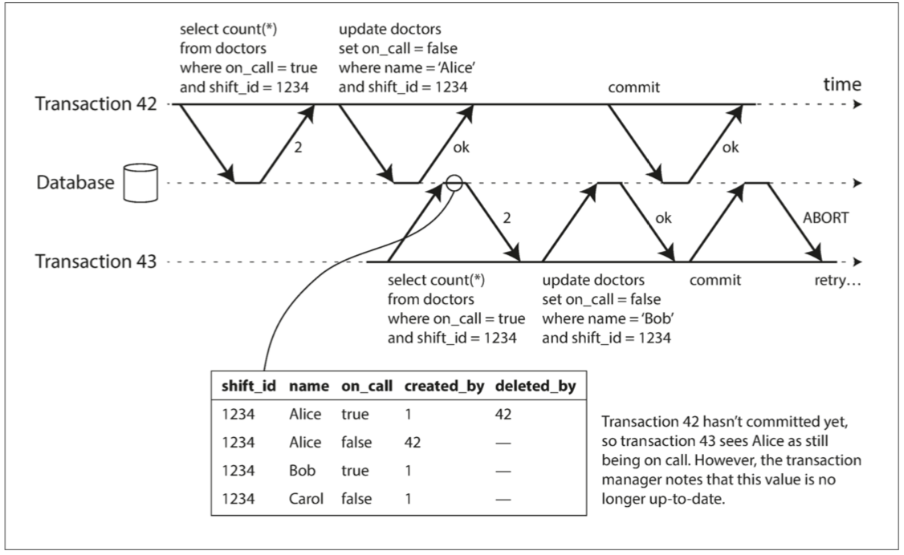
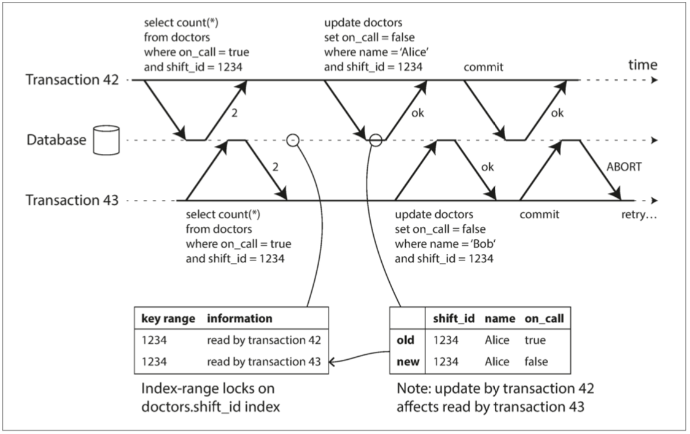

可串行化快照隔离（SSI, serializable snapshot isolation） 提供了完整的可串行化隔离级别，但与快照隔离相比只有很小的性能损失。
串行化快照隔离 是一种 乐观（optimistic） 的并发控制技术。

乐观锁在 contention 很高的时候，性能会不好；但是在 contention 不是很高的时候，一般会比悲观锁的性能好。

对于写入偏差的问题来说，事务基于一个前提进行，如果前提不存在了，继续提交则会导致问题。 所以如果可以检测前提是否仍然存在再提交或者中止则会避免这样的问题产生。

包括两种：
检测对旧 MVCC 对象版本的读取（读之前存在未提交的写入）
检测影响先前读取的写入（读之后发生写入）

