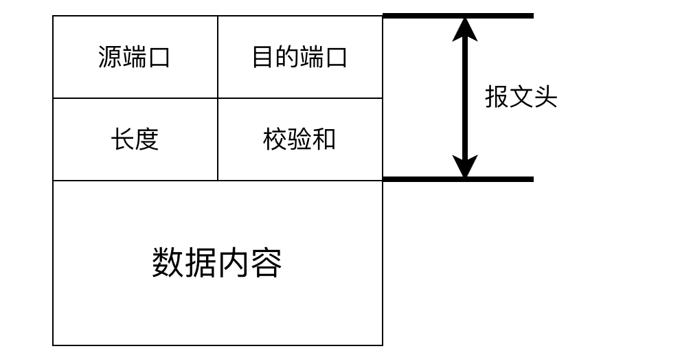
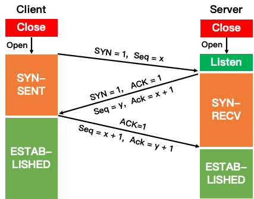
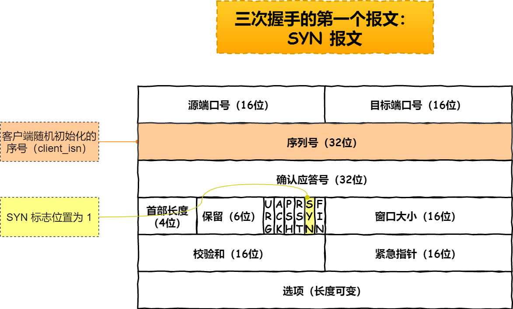
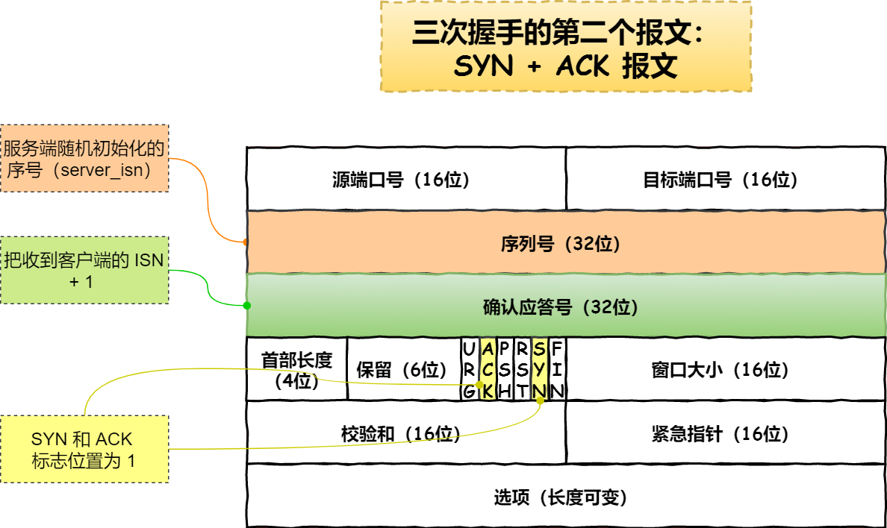
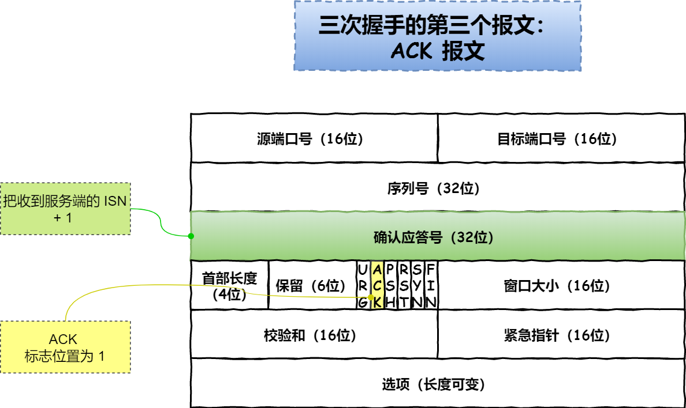

UDP 报文结构

理论上最大传输数据时 2^16 - 8 ； 但是由于数据包越大，丢包率越高。 因此通常设置为 512 或 8192 字节。

TCP 是面向连接的协议

三次握手从客户端开始。

握手前状态：客户端和服务端都是处于连接关闭状态。服务端首先处于 listen 状态，等待客户端连接，然后就进入三次握手。

1. 客户端向服务端发送一个SYN(synchronize)包，随后客户端进入SYN-SENT 阶段。
- 标志位为 SYN：表示请求建立连接；
- 序列号为 Seq = x(x 一般为随机数)；

2. 服务端收到客户端发送SYN包后，对该包进行确认后结束 LISTEN 阶段，并返回一段 TCP 报文，随后服务器端进入 SYN-RECV(同步接收) 阶段。
- 标志位为 SYN 和 ACK：表示确认客户端的报文 Seq 序号有效，服务器能正常接收客户端发送的数据，并同意创建新连接；
- 序号为 Seq = y，将自己的初始序列号同步给客户端。
- 确认号为 Ack = x + 1，表示收到客户端的序号 Seq 并将其值加 1 作为自己确认号 Ack 的值，告诉客户端自己接收的Seq没错；

3. 客户端接收到发送的 SYN + ACK 包后，明确了从客户端到服务器的数据传输是正常的，从而结束 SYN-SENT 阶段。并返回最后一段报文，随后客户端进入 ESTABLISHED状态。
- 标志位为 ACK，表示确认收到服务器端同意连接的信号；
- 序号为 Seq = x + 1，表示收到服务器端的确认号 Ack，并将其值作为自己的序号值；
- 确认号为 Ack= y + 1，表示收到服务器端序号 seq，并将其值加 1 作为自己的确认号 Ack 的值。

4. 当服务器端收到来自客户端确认收到服务器数据的报文后，得知从服务器到客户端的数据传输是正常的，从而结束 SYN-RECV 阶段，进入 ESTABLISHED 阶段，从而完成三次握手。

TCP 第一个报文内容

TCP 第二个报文内容

TCP 第三个报文内容

- 用于保证可靠性和流量控制维护的某些状态信息，这些信息的组合，包括Socket、序列号和窗口大小称为连接。

三次握手才可以阻止重复历史连接的初始化（主要原因）
三次握手才可以同步双方的初始序列号
三次握手才可以避免资源浪费

TCP 协议的通信双方， 都必须维护一个「序列号」， 序列号是可靠传输的一个关键因素，它的作用：
- 接收方可以去除重复的数据；
- 接收方可以根据数据包的序列号按序接收；
- 可以标识发送出去的数据包中， 哪些是已经被对方收到的（通过 ACK 报文中的序列号知道）；

第一次握手丢失了，会发生什么？ 客户端超时重传 - 超过若干次放弃
第二次握手丢失了，会发生什么？ 客户端服务端都会超时重传 - 若干次放弃
第三次握手丢失了，会发生什么？ 服务端超时重传 - 若干次放弃

ACK 报文是不会有重传的，当 ACK 丢失了，就由对方重传对应的报文。

