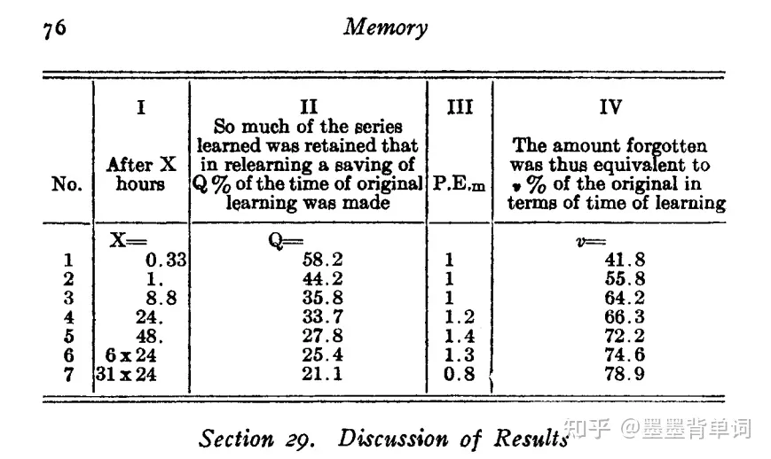

在 Memory: A Contribution to Experimental Psychology 中，艾宾浩斯提出了他的记忆曲线。

但和广为流传的艾宾浩斯记忆法实则没有关系。

艾宾浩斯先用辅音+元音+辅音的方式，构造了两千多个无意义的音节 从这些音节中随机抽样，组成长度不等的「伪单词」（如 XUD-QEV-KIZ），然后尝试记住它们

在记忆保持量的测量方面，艾宾浩斯采用了节省法，又叫重学法 即学习材料到恰能成诵时，间隔一段时间再重新进行学习，达到同样能背诵的程度，然后比较两次学习所用的时间和诵读次数，就可以得到一个绝对节省值

通过重学法 艾宾浩斯得出了相关的记忆曲线 

但是实际上这个实验一共只有一次记忆和一次重复记忆；并没有多次重复记忆的过程

而艾宾浩斯记忆法记忆间隔很多版本中采用了记忆曲线的间隔，实则是没有什么道理的营销手段而已。