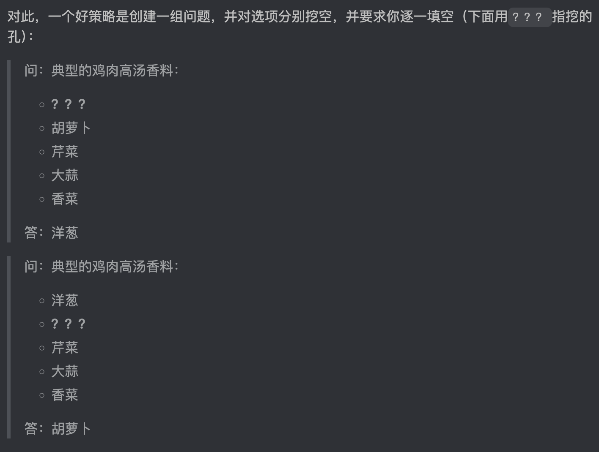

srs - spaced repetition systems

srs 的优劣取决于卡片质量的高低

设计卡片 -> 在给未来编制重复的任务

「提取练习」—— SRS的核心 - 你的回忆即对记忆的提取，提取行为会强化记忆

有效的卡片应该有的特点
- 卡片焦点明确 - 细节太多的问答不会让你专注 - 回答时的提取效应无法完整的刺激记忆
- 卡片能精确引导回答 - 模糊的问题只会引出模糊的答案
- 卡片应该能诱导出一致的回答 - 避免提取引发遗忘 - 想起来的答案会更加牢固、忘记的答案则会被抑制
- 卡片问答应该可控 - 写出自己几乎不会错答的卡片
- 卡片应该让提取费功夫 - 如果可以直接从卡面推测答案是不好的

这些内容中，有些知识是「事实性」的，有些是「过程性」的，还有些是「概念性」的。与之对应的制卡策略，将在后文一一陈述。

> 我们假如直接这么写卡：「制作鸡肉高汤需要什么？」，那么在回答的时候因为数量或者原料名称未作要求，所以很难作答。这样的卡片不够准确，也不够聚焦 ：同时要求提取的细节太多，所以想要加强的记忆不会全部被强力激活；并且因为它要的答案太多，因此的一致性、可控性也不好：每次回答，你会记起一些，又忘掉另一些。因此激活不够一致，容易导致记忆受到侵蚀。
> 所以，得把答案中的原料表分解为实际会学到的要素。如果你从未听说过高汤的话，你可以像下面第一问一样，先简单地澄清取用部位：
> 问：取鸡身上哪个「类型」的部位做高汤原料？
> 答：骨头。（Bones）

解释卡可以强化事实性提问的知识

> 实际上，一个专家的重要特征，可能就是基于越来越复杂的「组块」思考[12]。

> 每当处理主观、临时、或不全面的信息时，最好都体现出它的这种性质。因为大部分卡片给出的内容，或多或少都有临时性（比如换个菜谱可能用不同方式处理相同步骤），因此理论上我们可以把一切卡片都表述得不那么绝对，然而这弊大于利，因为太容易让人分心。平衡这个矛盾的一个办法是，我们简单记录信息来源（SRS 系统一般都有元数据项可以链接到原始菜谱），这在一般情况下已经足够了。

