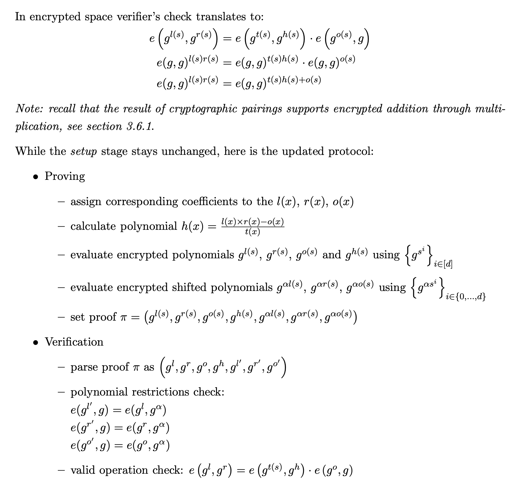

f(x) = 2x^2 - 9x + 10
g(x) = -4x^2 + 15x - 9

f(1) = 3
g(1) = 2

h(x) = f(x) * g(x) = -8x^4 +66x^3 -193x^2 + 231x - 90
h(1) = 6 = f(1) * g(1)

h'(x) = f(x) + g(x) = -2x^2 +6x + 1
h'(1) = f(1) + g(1) = 5

---

对于多项式来说 算术运算的性质是保留的

---

如何 enforce operation 呢？

---

> If a prover claims to have the result of multiplication of two numbers how does verifier checks that? 

